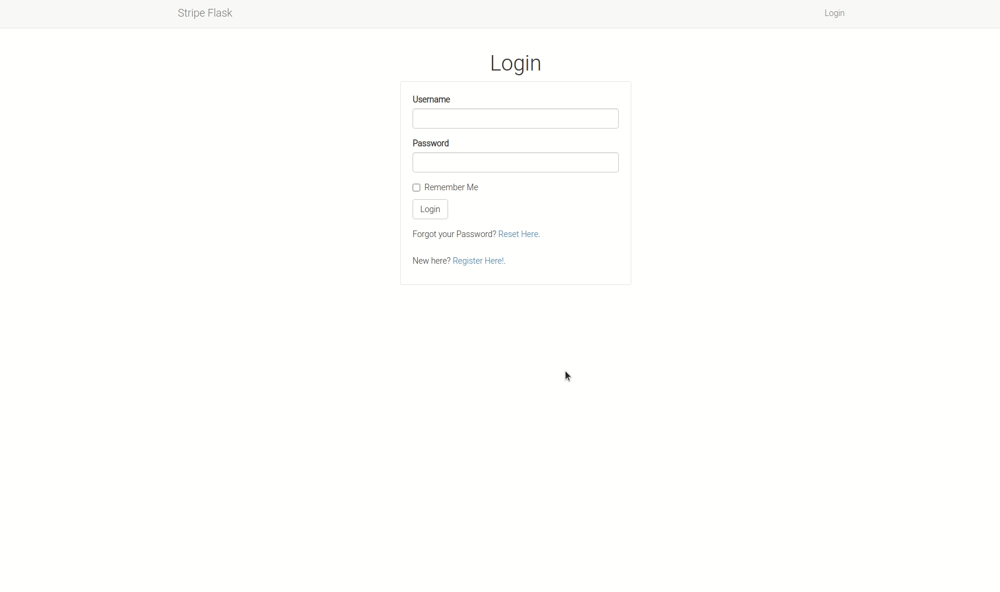

# Integrating Stripe with Flask

Stripe is an online payment processing platform that allows businesses to send and receive payments over the internet. Stripe Payments makes it easier for merchants to start and control an online business by building a set of products that could save many hours, money, and resources that are required for creating and setting up an online payment processor to start accepting online payment from customers.




### Features

* User authentication
* Password reset capability
* Online card payment

### Tools Used

* Flask web framework
* Stripe API
* Flask login for user authentication
* Flask mail for password resets through email
* Flask bootstrap to styling and cross browser responsiveness
* Python dotenv to load environment variables
* Ngrok for localhost testing
* Flask migrate to handle database migration
* SQLite database
* Flask wtf for web form creations

### Deployed Application

* [Stripe Flask Demo](https://stripe-flask-integration.herokuapp.com/)

### Contributors

* [Gitau Harrison](https://github.com/GitauHarrison)

### Testing Locally

* If you do not have a Stripe account, create a [free account](https://dashboard.stripe.com/register) now.
* Add an account name
* From your dashboard, navigate to [Developers](https://dashboard.stripe.com/test/developers)
* Click [API Keys](https://dashboard.stripe.com/test/apikeys)
* Also create an API Key from [Webhooks](https://dashboard.stripe.com/test/webhooks)

We will use these keys to run the application. Make sure to save them somewhere safe for later.

1. Clone this repo:

```python
$ git clone git@github.com:GitauHarrison/integrating-stripe-payment-in-flask.git
```

2. Move into the cloned directory:

```python
$ cd integrating-stripe-payment-in-flask
```

3. Create and activate your virtual environment:

```python
$ mkvirtualenv stripe_flask_demo # I am using a virtualenvwrapper
```

4. Install used dependencies within your new virtual environment:

```python
(stripe_flask_demo)$ pip3 install -r requirements.txt
```

5. Before you can run your server, remember to create a `.env` file following the guidance seen in the `.env.template`. Create a `.env ` file in the root directory:

```python
(stripe_flask_demo)$ touch .env
```
6. Update the `.env` file with all the necessary API Keys details saved earlier:

```python
STRIPE_PUBLISHABLE_KEY=
STRIPE_SECRET_KEY=
STRIPE_ENDPOINT_SECRET=
# See template for all variables
```

7. Run the flask server:

```python
(stripe_flask_demo)$ flask run
```

8. Once your application is running, you can access your localhost on http://127.0.0.1:5000/. Additionally, if you look carefully in your terminal, you will see: * Tunnel URL: NgrokTunnel: "http://4209c9af6d43.ngrok.io" -> "http://localhost:5000"

The HTTP value may be different from the one shown here because I am using the free tier package of ngrok. Paste the link http://4209c9af6d43.ngrok.io on another device, say your mobile phone, to test the application while it is on localhost.

**Make sure to replace `domain_url` value with `http://localhost:5000/` in `app/main/routes.py`**

Another way to obtain ngrok's free public URLs would be to run the command below in a new terminal window:

```python
(flask_2fa)$ ngrok http 5000

# Output

ngrok by @inconshreveable                               (Ctrl+C to quit)
                                                                        
Session Status                online                                    
Session Expires               1 hour, 58 minutes                        
Version                       2.3.35                                    
Region                        United States (us)                        
Web Interface                 http://127.0.0.1:4042                     
Forwarding                    http://6e95e59c2233.ngrok.io -> http://loc
Forwarding                    https://6e95e59c2233.ngrok.io -> http://lo
                                                                        
Connections                   ttl     opn     rt1     rt5     p50     p9
                              0       0       0.00    0.00    0.00    0.
```

Note the lines beginning with 'Forwarding'. These show the public URLs that ngrok uses to redirect requests into our service. This method provides you with https://. You can use the `https://` URL to securely test the application, even though it can run on `http://`.

### Build it Yourself
If you would like to incorporate this feature, try it out by creating your own project line after line. You can follow this [stripe integraton in flask](https://github.com/GitauHarrison/notes/blob/master/how_to_use_stripe_for_payment.md) guide.

### Reference
* This application assumes that you have a basic understanding of python and flask. If not, start [here](https://gitauharrison-blog.herokuapp.com/personal-blog).
* If you do not know what the command `mkvirtualenv` is, learn more [here](https://gitauharrison-blog.herokuapp.com/virtualenvwrapper).